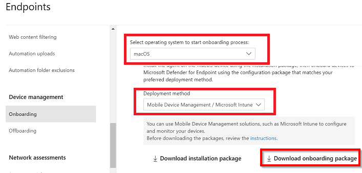
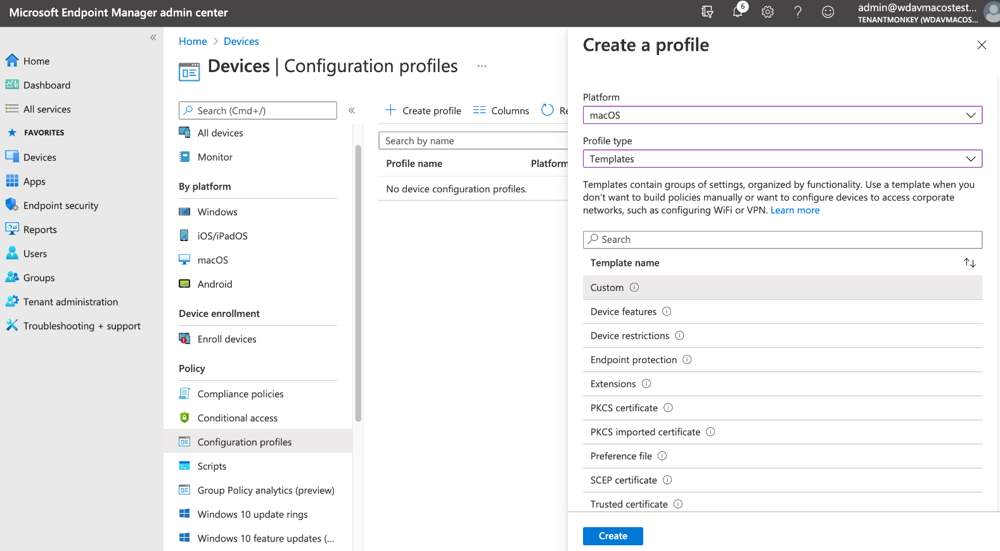
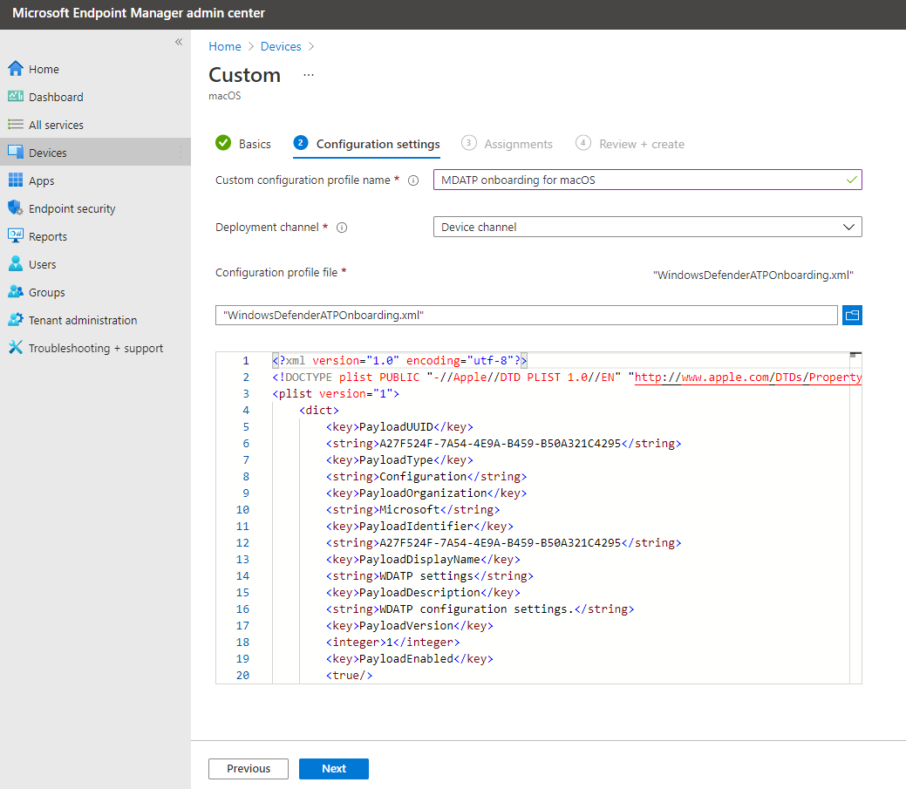
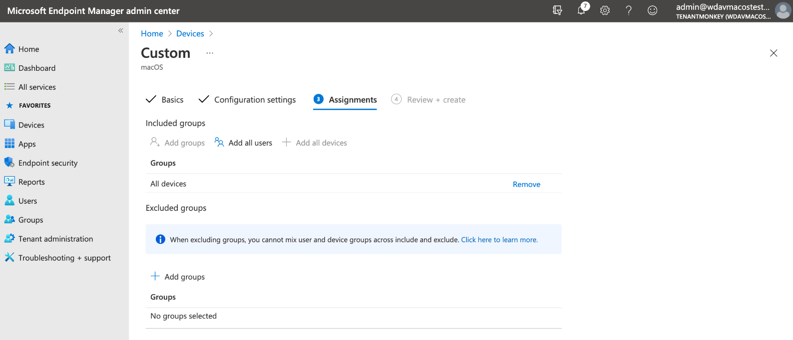

# A collection of configuration files for the deployment of Microsoft Defender for Endpoint on macOS

All files can be imported to Microsoft Intune using the community tool provided by **@Micke-K** - https://github.com/Micke-K/IntuneManagement

You should always test thoroughly in your own development environment before deploying to production.

# Important! - You **must** download your own onboarding package from the Microsoft Defender portal

I cannot provide the onboarding package for MDE as this is specific to your tenant - You can follow the steps here to download your onboarding package - https://learn.microsoft.com/en-us/microsoft-365/security/defender-endpoint/mac-install-with-intune?view=o365-worldwide#download-the-onboarding-package - The file you will need is the **WindowsDefenderATPOnboarding.xml** 

Create a new config profile using the profile type **Templates** and then Template name **Custom** 

Give the profile an appropriate name, such as **macOS - Onboarding for MDE** 

Select **Device channel** for the Deployment channel and then upload the previously downloaded **WindowsDefenderATPOnboarding.xml**

Assign this to your required groups - Unless you have good reason, I would suggest assigning to the built in **All devices** group.

Once you have created this file and imported those provided you can assign them to your chosen groups.

# Breakdown of each file

**macOS - Content Filter Service - Network Filter for MDE**

Required for the EDR capabilities, MDE on macOS inspects socket traffic and reports this information to the Microsoft 365 Defender portal, this profile allows the network extensions to function.

**macOS - Login Items - Background Services for MDE**

From macOS 13 (Ventura) by default applications connot run in the background without explicit consent, MDE must run its daemon process in the background. This config profile grants the Background Service permissions to MDE.

**macOS - Notification Settings - Notifications for MDE**

This profile is used to allow Microsoft Defender for Endpoint on macOS and Microsoft Auto Update to display notifications in UI.

**macOS - PPPC - Full Disk Access for MDE**

Enabling TCC (Transparency, Consent & Control) through an Mobile Device Management solution such as Intune, will eliminate the risk of Defender for Endpoint losing Full Disk Access Authorization to function properly.

This configuration profile grants Full Disk Access to Microsoft Defender for Endpoint.

**macOS - Preferences - Configuration Settings for MDE**

This profile configures the preferences for MDE - It uses the Intune recommended profile provided by Microsoft here - https://learn.microsoft.com/en-us/microsoft-365/security/defender-endpoint/mac-preferences?view=o365-worldwide#intune-recommended-profile 

It enables the following:
- Real-Time Protection set to Enabled
- Potentially unwnated applications set to Block
- Archive Bomb set to Audit
- Cloud-delivered protection set to Enabled
- Automatic Sample Submission set to True
- Tamper Protection set to Block (enabled) **Tamper Protection both blocks and reports attacks to the Cloud** 

You can find more preference options here - https://learn.microsoft.com/en-us/microsoft-365/security/defender-endpoint/mac-preferences?view=o365-worldwide#configuration-profile-structure 

**macOS - Preferences - Enable Network Protection**

Prerequisites
- MDB (Defender for Business), MDE Plan 1 or MDE Plan 2
- Minimum macOS version: 11
- Product version 101.94.13 or later

All of your currently configured Network Protection and Web Threat Protection policies will be enforced on macOS devices where Network Protection is configured for block mode.

It is advised to evaluate the impact of Network Protection features on a small subset of devices before wider production rollout. More info can be found here - https://learn.microsoft.com/en-us/microsoft-365/security/defender-endpoint/network-protection-macos?view=o365-worldwide 

**macOS - Preferences - Update Policy for MDE**

This profile is used to configure the update preferences for MDE via the Microsoft AutoUpdate tool for macOS. More info can be found here - https://learn.microsoft.com/en-us/microsoft-365/security/defender-endpoint/mac-updates?view=o365-worldwide#intune 

**macOS - SEXT - Approve System Extensions for MDE**

For macOS version 11 (Big Sur) or later this profile is required in order to approve the system extensions required for MDE.